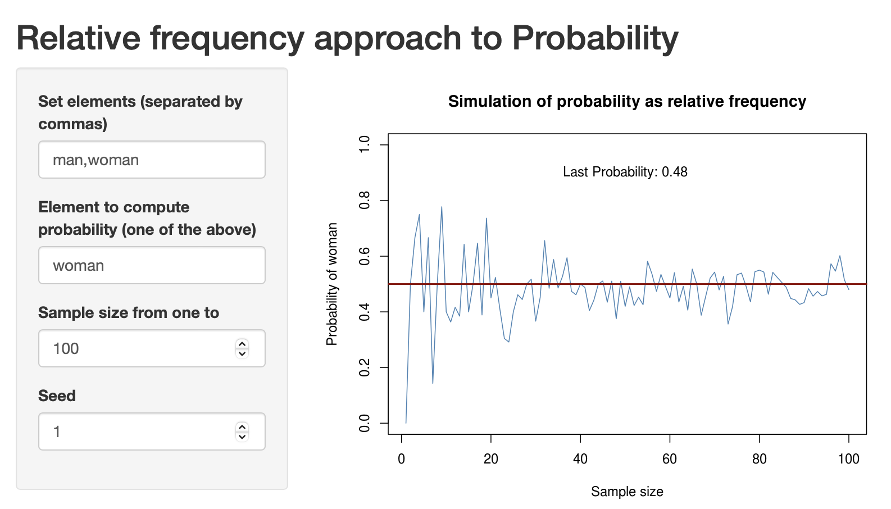
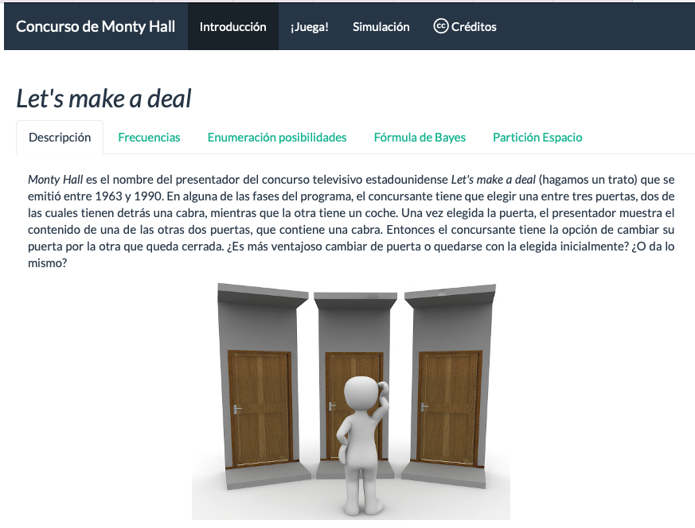

```{r setup, include=FALSE}
knitr::opts_chunk$set(echo = TRUE)
library(tidyverse)
library(readxl)
library(likert)
```


**RESUMEN**

La Estadística es campo de conocimiento transversal con el que podemos abordar una gran variedad de problemas con la misma técnica estadística. En los grados de Ciencias e Ingeniería y de Ciencias Sociales es una materia de formación básica y obligatoria.
No obstante, los estudiantes suelen tener una motivación baja para la asignatura, en parte por la dificultad que tienen para entender conceptos abstractos. Esto se agrava cuando los egresados no son capaces de afrontar con solvencia análisis estadísticos en su vida profesional.
En este trabajo presentamos una serie de aplicaciones interactivas desarrolladas con el software estadístico y lenguaje de programación R y el paquete shiny. En concreto, una de las aplicaciones se utiliza para ilustrar la definición de probabilidad como frecuencia relativa en el límite. Su impacto se ha evaluado en el grupo de la asignatura Bioestadística del Grado en Biología de la Universidad Rey Juan Carlos.


**ABSTRACT**

Statistics is a cross-disciplinary field of knowledge with which we can tackle a great variety of problems with the same statistical technique. In the degrees of Science and Engineering and Social Sciences it is a basic and mandatory course.
However, students usually have a low motivation for the course, partly because of the difficulty they have in understanding abstract concepts. This is even worse when graduates are not able to cope with statistical analysis in their jobs.
In this paper we present a series of interactive applications developed with the statistical software and programming language R and the shiny package. In particular, one of the applications is used to illustrate the definition of probability as relative frequency in the limit. Its impact has been evaluated in the group of the Biostatistics course within the Degree in Biology of Rey Juan Carlos University.


**Palabras clave**

Aplicaciones interactivas, Enseñanza de la Estadística, Simulación, Software R

**Keywords**

Interactive applications, Statistical teaching, Simulation, R Software


# INTRODUCCIÓN

## La Estadística como enseñanza transversal

La Estadística es una materia obligatoria en los grados de Ciencias e Ingeniería, así como en muchos grados de Ciencias Sociales. Así, es un campo de conocimiento transversal que se aplica a una multitud de problemas de diversa índole, pero que se pueden abordar con la misma técnica estadística.

La experiencia nos dice que, en muchas ocasiones, la asignatura no despierta suficiente interés entre el estudiantado. Muchas pueden ser las causas de este desinterés, entre otras las siguientes: (1) Encontrarse en primer curso, donde todavía no ven la aplicabilidad; (2) Falta de base matemática para abordar ciertos problemas; (3) Predominio de metodologías docentes clásicas frente a otras más innovadoras; (4) Predominio de las explicaciones teóricas frente al trabajo empírico; (5) Uso de ejemplos y casos de estudio genéricos o lejos de su ámbito de conocimiento.

Pero independientemente de los motivos, nos gustaría destacar en este trabajo la dificultad que tienen los estudiantes para entender conceptos abstractos. Y el hecho de que esta dificultad se extiende más allá de los estudios de grado, encontrándonos egresados en distintos sectores de actividad que no son capaces de afrontar con solvencia análisis estadísticos que se supone aprendieron en su etapa en la universidad.
Mirando hacia atrás, en [@naya2012estadistica] podemos encontrar algunas reflexiones sobre las carencias que históricamente se arrastran en la enseñanza de la Estadística en etapas preuniversitarias.

En el Grupo de Innovación Docente "Laboratorio de Ciencia de Datos para la Innovación de la Enseñanza" trabajamos para facilitar el uso de técnicas y métodos de Ciencia de Datos a la innovación de la enseñanza. En este trabajo proponemos el uso de aplicaciones interactivas innovadoras que ayuden, por un lado, a la comprensión de los conceptos estadísticos, y por otro a la mayor implicación y motivación del alumnado en las asignaturas.

## Estado del arte

En la literatura podemos encontrar numerosos trabajos [@Moore1997;@Hogg1985;@Romeu2006;@Romeu2012] que abogan por orientar la enseñanza de la estadística desde un enfoque más práctico, disminuyendo en cierta medida el enfoque teórico que se le da a esta materia. En [@Romeu2006], Romeu evalúa diversas formas de mejorar la educación estadística en la rama de ingeniería, denunciando que uno de los principales problemas es que los cursos de estadística que se ofrecen a los estudiantes son muy teóricos, con apenas práctica, y, en muchas ocasiones, tratan de cubrir un amplio temario en poco tiempo. Por lo que, finalmente los estudiantes no perciben la estadística como una herramienta que vayan a necesitar en el desarrollo de su vida profesional.

Tradicionalmente, en Europa se ha optado por enseñar la estadística desde un punto de vista más teórico, otorgando de una gran relevancia a los teoremas y sus correspondientes demostraciones teóricas. Sin embargo, el enfoque que se le ha dado en EEUU es más práctico [@El1990]. Presentan la materia como una herramienta de investigación muy versátil, en el sentido de que se aplica en multitud de áreas de conocimiento: ingeniería, medicina, economía, psicología, periodismo, sociología, etc.

Con el fin de darle más énfasis a un enfoque práctico de la estadística, una solución accesible es optar por el uso de una herramienta informática. El abanico de opciones es tan amplio que conviene realizar un análisis detallado de algunas de ellas. Por un lado, tenemos potentes herramientas de cómputo desarrolladas por empresas privadas, como:

-	Statistical Analysis System (SAS). Es un paquete software desarrollado por SAS Institute capaz de realizar análisis estadísticos básicos, análisis multivariantes e incluso análisis predictivo. 
-	SPSS. Se trata de otro software comercial de análisis estadístico muy completo y avanzado. Por lo que no está pensado para usuarios noveles. Es ampliamente usado en el ámbito profesional. 
-	Minitab. Es un potente software de pago para análisis estadístico. Fue desarrollado en la Universidad del Estado de Pensilvania por Barbara F. Ryan, Thomas A. Ryan, Jr. Y Brian L. Joiner en 1972. Está más enfocado a un uso empresarial que didáctico. Lo cual no quita que se hayan llevado a cabo experiencias docentes satisfactorias con él. En el trabajo [@Romeu1998], los autores muestran un ejemplo de aplicación del aprendizaje cooperativo en estudiantes de carreras no matemáticas con el fin de promover entre ellos el interés en un curso de estadística. De las encuestas que realizaron los estudiantes una vez finalizadas todas las sesiones de laboratorio, destacaron como uno de los aspectos más positivos de la experiencia la comprensión del material de clase, llegando a conectar perfectamente los aspectos teóricos con las aplicaciones gracias al uso del software.
-	Statistics Problem Solver. Es un software informático que además de resolver los problemas de estadística, ofrece una explicación paso a paso sobre cómo se ha resuelto, mostrando las fórmulas y teoremas que se han empleado en el proceso. Tan solo hay que rellenar los cuadros en blanco con los datos del problema que queremos resolver. Está diseñado en base al curso de "Estadística y Probabilidad" de la Universidad de Ottawa (MAT2377), por lo que es especialmente recomendable para estudiantes universitarios. Los algoritmos de solución que emplea el software están basados en el libro [@vining1998statistical] de G. Geoffrey Vining. Con este software se pueden generar histogramas, analizar distribuciones discretas y continuas, realizar pruebas de hipótesis y comparar datos estadísticos.

Uno de los principales inconvenientes que podemos encontrar en estas herramientas, desde un punto de vista docente, es que todas son de pago y es necesario adquirir una licencia. Sin embargo, puesto que nuestro principal interés es motivar a nuestros estudiantes y facilitar su proceso de aprendizaje, podemos encontrar otras opciones que no requieran un desembolso importante. Por ejemplo, Stats Solver (https://www.statssolver.com/) es una página web a la que podemos acceder desde cualquier navegador y nos permite resolver cualquier problema estadístico que se pueda plantear en un curso universitario de estadística. En el menú desplegable que aparece en la parte superior se selecciona el tipo de problema estadístico que se quiere resolver y, a continuación, se introducen los datos en los cuadros de texto en blanco. Al presionar en Solve, nos muestra la solución junto con una explicación teórica de cómo debe resolverse. En este sentido, podemos decir que es una herramienta muy didáctica y fácil de usar. También cabe destacar que, al no requerir instalación ninguna, tampoco consume recursos de CPU ni memoria de nuestro ordenador.

Pero si queremos dar rienda suelta a nuestra capacidad de análisis, Stats Solver se nos queda corto, ya que no nos permite construir nuestras propias soluciones. No buscamos enseñar a nuestros estudiantes el manejo de un software estadístico, sino completar las explicaciones con casos prácticos y conseguir que los estudiantes, mediante su propia experiencia, asimilen mejor los conceptos y su aplicabilidad. Podemos pensar, entonces, en R [@R-base], un lenguaje de programación estadístico. La primera versión fue creada en la Universidad de Auckland, Nueva Zelanda en la década de los 90 por Robert Gentleman y Robert Ihaka, a partir del lenguaje S desarrollado, entre otros, por John Chambers [chambers2008software]. En la actualidad se considera la herramienta de análisis estadístico por excelencia, ampliamente utilizada tanto en el ámbito docente como en el empresarial. Con este lenguaje podemos llevar a cabo cualquier análisis estadístico por complicado que sea.

Todas estas herramientas de ordenador han sido diseñadas con un propósito general, poder resolver problemas estadísticos. En este sentido podemos decir que cumplen con creces su propósito. Pero este no es nuestro objetivo. No buscamos una herramienta de cómputo potente que nos permita llevar a cabo cualquier análisis estadístico, sino que lo que buscamos es una herramienta didáctica que ayude a nuestros estudiantes a entender la estadística y saber aplicarla a la vida real. Con R podemos implementar nuestras propias aplicaciones, centradas en la adquisición de conceptos determinados sin que los estudiantes tengan que enfrentarse a la complejidad que suponga el manejar una herramienta software de análisis estadístico.

Por este motivo hemos desarrollado algunas aplicaciones específicas utilizando el paquete shiny [@R-shiny] de R. Una de las mayores potencialidades de estas aplicaciones es que podemos programar simulaciones de variables aleatorias, de forma que el estudiante puede después reproducir los "experimentos" y convertirlos así en una experiencia propia. 


# METODOLOGÍA

## Material y métodos

Para el desarrollo de las aplicaciones interactivas, utilizamos el software estadístico y lenguaje de programación R (https://www.r-project.org). R es desde hace años el estándar "de facto" para análisis de datos. No obstante, al ser también lenguaje de programación, sus posibilidades son ilimitadas, como demuestran los más de 18.000 paquetes desarrollados por la comunidad para una gran variedad de dominios de aplicación. Algunos paquetes constituyen auténticos "frameworks" para el desarrollo de aplicaciones, como es el caso del paquete "shiny" (https://shiny.rstudio.com). Con shiny podemos desarrollar aplicaciones interactivas que se ejecutan en el navegador, sin necesidad de saber programar páginas web. Todo se genera mediante funciones de R de forma análoga a como se haría un análisis de datos.

Los métodos y herramientas de Ciencia de Datos, como la simulación y el software estadístico R, nos permiten simular cualquier experimento aleatorio, un número grande de veces, y personalizando para cada dominio de aplicación.
En las aplicaciones que hemos desarrollado tiene un gran protagonismo la **simulación**. Una parte importante de la estadística consiste en modelizar fenómenos aleatorios para poder estudiarlos y tomar decisiones. R contiene una gran variedad de funciones para generar realizaciones de variables aleatorias y así poder simular cualquier experimento o fenómeno que queramos utilizar para enseñar un método o concepto estadístico. La principal ventaja es que cada vez que vayamos a ejecutar la aplicación, será una experiencia nueva, y se podrán relacionar los resultados con el método o concepto, más allá de los datos concretos de un ejercicio.

Para el desarrollo de las aplicaciones, usamos un enfoque reproducible y colaborativo, con el entorno de desarrollo (IDE por sus siglas en inglés) RStudio (https://www.rstudio.com) [@R-rstudioapi]. RStudio se integra muy bien con el sistema de control de versiones git (https://git-scm.com) y los repositorios de GitHub (https://github.com), lo que nos permite trabajar en equipo de forma eficiente y llevar un control exhaustivo de versiones. El código fuente de las aplicaciones está en repositorios públicos y abierto a la contribución de otros. Las aplicaciones están publicadas en el servicio de RStudio shinyapps.io (https://www.shinyapps.io). No obstante, se puede ejecutar en cualquier ordenador con R y los paquetes utilizados por la aplicación.

A continuación describimos dos aplicaciones. La primera la utilizamos para ilustrar la definición de probabilidad como frecuencia relativa en el límite. Un ejemplo clásico sería lanzar una moneda al aire repetidas veces y contar el número de caras que salen en una sucesión de n "experimentos". La probabilidad de obtener cara sería, asintóticamente, el número de caras dividido entre el total de tiradas. Una actividad "manipulativa" podría consistir en poner a los estudiantes a lanzar monedas, anotar las caras y hacer los cálculos. Pero llevaría demasiado tiempo para un concepto básico. La segunda aplicación es un poco más compleja, como también lo es el concepto que enseñamos: la probabilidad condicionada. En este caso utilizamos el famoso problema de _Monty Hall_, descrito en muchos libros, como por ejemplo [@YUSTE2011] y que incluso aparece en obras de ficción como "El curioso incidente del perro a medianoche" o la película "21 Blackjack". 


## Aplicaciones

La aplicación "Relative frequency approach to Probability" ilustra el importante concepto de probabilidad como frecuencia relativa en el límite. Está publicada en https://elcano.shinyapps.io/probability_as_relative_frequency/. La ventaja frente al ejemplo de la moneda, es que podemos utilizar “sucesos” más próximos a los intereses de los estudiantes. Por ejemplo, en el grado en Videojuegos podemos hablar de la probabilidad de que aparezca un atacante o un defensor; en el grado en Biología, podemos hablar de la probabilidad de que un tratamiento sea efectivo o no; y así sucesivamente.
La aplicación (veáse la Figura \@ref(fig:freq)) consta de un menú lateral donde se introducen los elementos equiprobables que se quieren simular, y el elemento del que se quiere calcular la probabilidad. A continuación, el tamaño de muestra (número de experimentos) y la semilla, que se fija para que el experimento sea reproducible. El gráfico del panel principal de la aplicación se actualiza automáticamente, simulando el número de experimentos y calculando la frecuencia relativa después de cada tirada. Se representa como un gráfico secuencial donde se ve claramente cómo la frecuencia relativa converge a la probabilidad teórica. Por defecto, en la aplicación se muestra el conjunto de dos valores posibles: "man" y "woman", pero como se ha dicho se puede personalizar el ejemplo (incluso al clásico del lanzamiento de un dado o una moneda).


```{r freq, fig.cap="Aplicación para ilustrar la probabilidad como frecuencia en el límite", echo=FALSE, out.width="60%", fig.align='center'}

```


La aplicación "Concurso de Monty Hall" es algo más compleja (véase la figura \@ref(fig:monty). 
Está publicada en https://elcano.shinyapps.io/monty_hall/. Consta de cuatro paneles, en el primero de los cuales aparece la descripción del problema y la solución desde cuatro puntos de vista diferentes. El problema tiene una solución a priori contraintuitiva y sorprendente, que incluso después de la explicación puede plantear dudas (en [@YUSTE2011] se pueden encontrar algunas anécdotas incluso con reputados matemáticos). El estudiante puede jugar partidas una a una y ver el resultado de sus jugadas acumuladas. En cierto modo, es otra forma de comprobar empíricamente la probabilidad como frecuencia relativa de la anterior aplicación. Por último, en el panel de simulación se pueden realizar un número grande de jugadas y ver el resultado según la estrategia del jugador. Como resultado, se obtienen las frecuencias y también visualizaciones gráficas con animación de las simulaciones.

```{r monty, fig.cap="Aplicación para ilustrar la importancia de la probabilidad condicionada", echo=FALSE, out.width="60%", fig.align='center'}

```


# RESULTADOS

Los resultados que obtenemos en las clases son muy positivos. En la primera aplicación, los estudiantes pueden elegir cuáles son las opciones (no solo dos, sino más de dos, como por ejemplo en el lanzamiento de un dado) y comprueban con ejemplos más cercanos cómo la probabilidad “converge” a la probabilidad teórica, y esto después se traduce en que realizan los ejercicios con menos dudas.

En el curso 2021/2022 se ha recogido retroalimentación de los estudiantes del Grado en Biología cursando la asignatura Bioestadística. El reto en esta asignatura es todavía mayor, ya que es una asignatura con solo 3 créditos (30 horas de clase) con un temario incluso más amplio que en otros grados de ciencias o ingeniería. 
```{r likert, fig.cap="Valoración de distintos elementos de la metodología docente", fig.width=9, echo=FALSE}
encuesta <- read_excel("BIOESTADÍSTICA 2021-22 (respuestas).xlsx") |> 
  mutate(across(2:6, ~factor(., levels = 1:5, labels = c(" 1 (Nada)", "2", "3", "4", "5 (Mucho)"))))
items <- tibble(item = paste0("ITEM_", 
                              formatC(1:ncol(encuesta), 
                                      width = 2, flag = 0)), 
                pregunta = colnames(encuesta),
                elemento_evaluado = c("_timestamp", 
                                      "Cumplimiento objetivos nota",
                                      "Cumplimiento aprendizaje estadística",
                                      "Guía de evaluación exámenes ayuda",
                                      "Guía de evaluación trabajos ayuda",
                                      "La aplicación ayuda a comprender probabilidad",
                                      "_comments")) 
colnames(encuesta) <- items$elemento_evaluado
kk <- likert.options(legend = "Respuesta")
lbio <- likert(as.data.frame(encuesta[,2:6]))
plot(lbio) + 
  guides(fill = guide_legend(title = "Respuesta: ")) +
  labs(title = "Valoración de metodologías docentes Bioestadística",
       y = "Porcentaje")
```

El instrumento utilizado para la recogida de información fue un formulario en Google Docs, fuera del aula virtual para garantizar el total anonimato, e incluía también una pregunta abierta de sugerencias o comentarios. El grupo era de 70 estudiantes, aunque la respuesta fue baja (12 respuestas). Aún así, la información que nos proporciona es muy valiosa. Por una parte, la mayoría de los estudiantes (58%) dio una respuesta positiva a la pregunta sobre si la aplicación de probabilidad como frecuencia en el límite le ayudó a comprender mejor el concepto. No obstante, también vemos que hay un amplio margen de mejora, puesto que el porcentaje de respuestas negativas (33%) todavía es muy alto. En relación a las otras metodologías por las que se les preguntó, valoraron muy positivamente las guías de evaluación en trabajos y exámenes y su retroalimentación. Podemos observar también que su percepción del aprendizaje estuvo por encima de su expectativa en la calificación.


# CONCLUSIONES

La principal conclusión de este trabajo es que las aplicaciones interactivas que incluyen simulación contribuyen a mejorar el aprendizaje de conceptos abstractos de Estadística.
Es importante destacar que la metodología propuesta no es exclusiva para la enseñanza de la Estadística, sino que se puede aplicar a cualquier asignatura en la que se puedan utilizar datos, funciones matemáticas, gráficos, o simulación, y en las que la interacción del estudiante provoque distintos resultados que le ayuden a interiorizar los conceptos. Un ejemplo en criptografía se puede encontrar en la aplicación para encriptar con el código César que se encuentra en https://elcano.shinyapps.io/cesar/. Por otra parte, en asignaturas que impliquen la gestión de proyectos, se pueden aprovechar sinergias con metodologías ágiles como Scrum [@Cano2016] para incluir la simulación en la asunción de roles.

Como trabajo futuro, el Grupo de Innovación Docente "Laboratorio de Ciencia de Datos para la Innovación de la Enseñanza" está ya trabajando en desplegar estas y futuras aplicaciones en el servidor propio del grupo, e implementar integración y despliegue continuo desde los repositorios de GitHub para un mantenimiento más ágil. Asimismo, está previsto la mejora visual de las aplicaciones más sencillas, así como su versión en español.


# REFERENCIAS


```{r include=FALSE}
# automatically create a bib database for R packages
knitr::write_bib(c(
  .packages(), 
  'base',
  'bookdown', 'knitr', 'rmarkdown',
  'shiny', 'rstudioapi'
), 'packages.bib')
```
 

 

